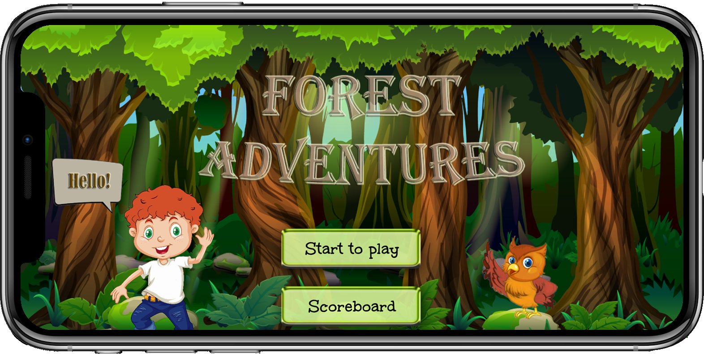
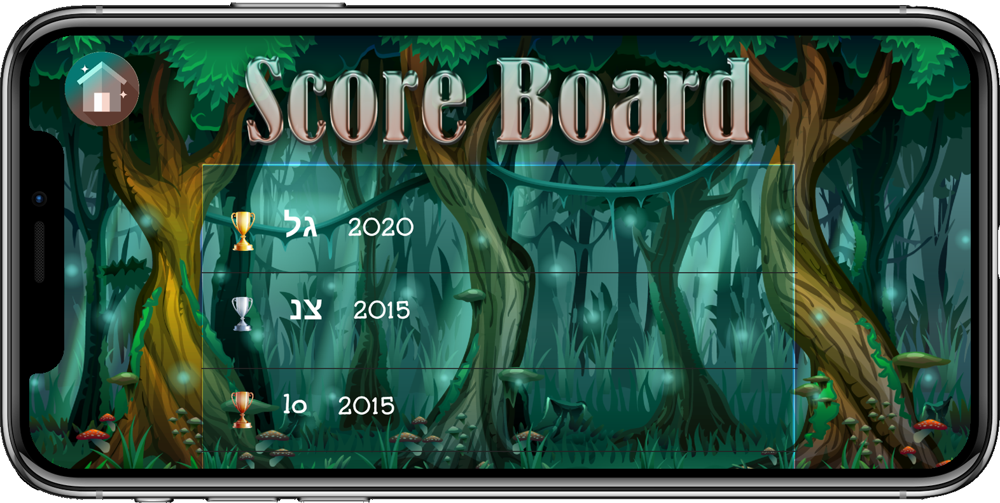
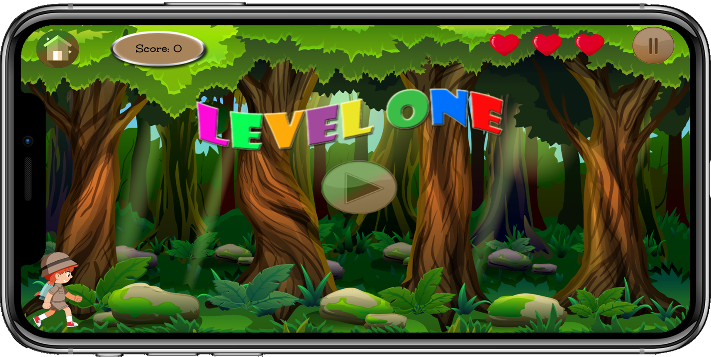
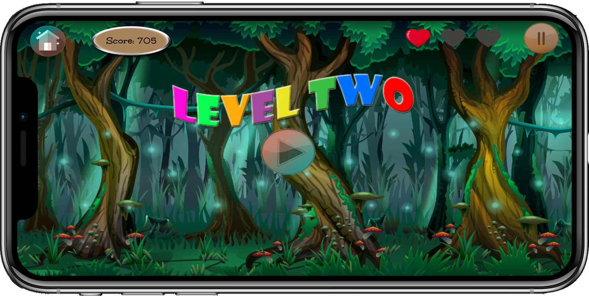
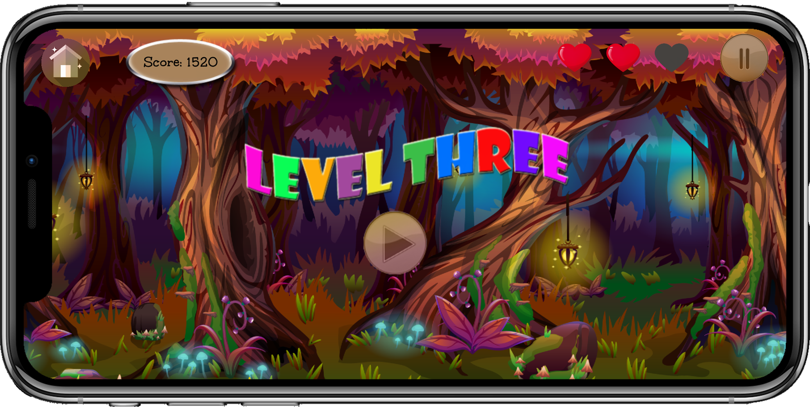
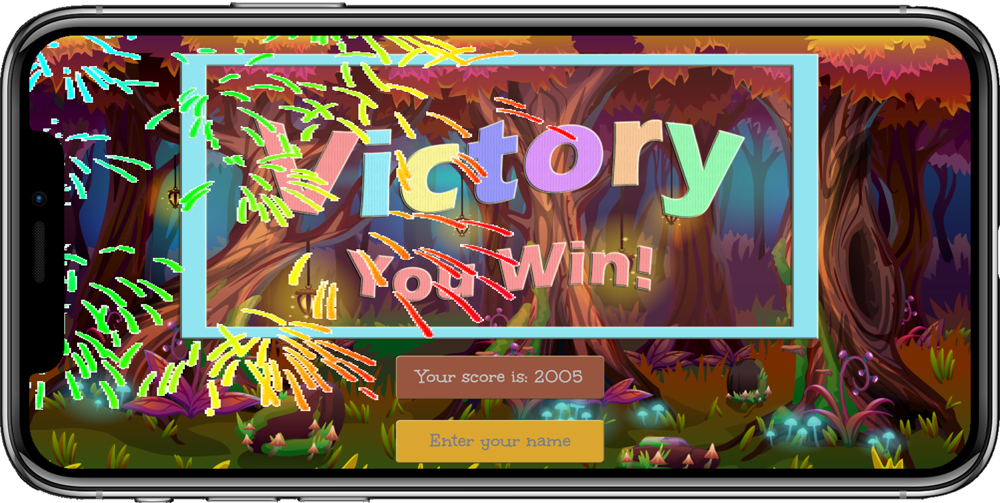
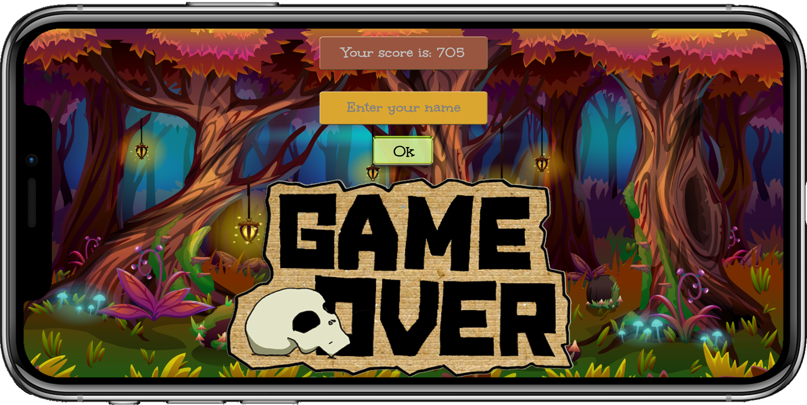

# ForestAdventures
Android game, using Android Studio written in Java. 

Developed as part of an Android course.

The game includes animations, 3 levels in ascending difficulty, and 3 types of enemies.

# Screenshots:

